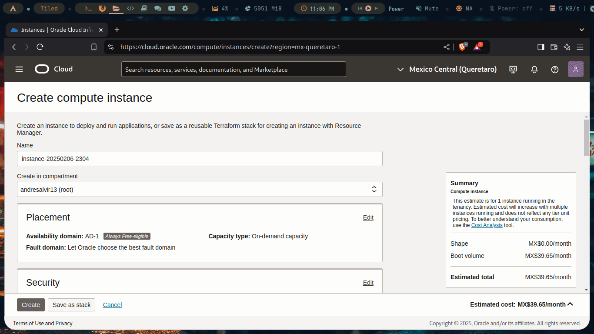
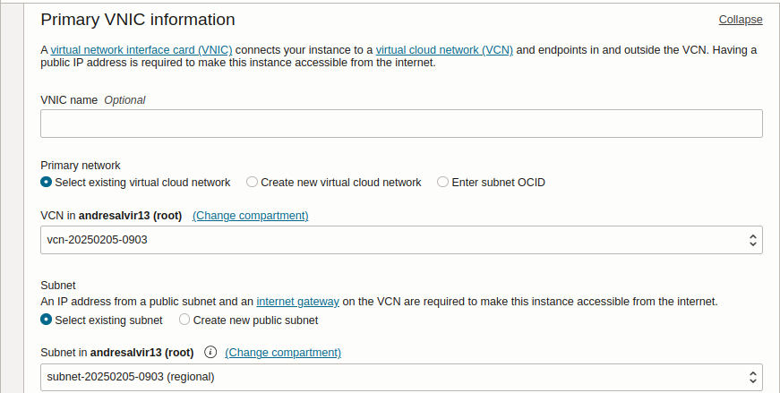

After spending some time searching for a secure way to create a simple Minecraft server to play with a couple of friends, I came across plenty of methods to do it. This project turned out to be a fun way to learn about web hosting and server management.

Initially, I explored **tunneling**, which was useful at first. However, I soon ran into limitations, such as my own hardware constraints and the need to keep my system running at all times. I also experimented with **port forwarding**, but it had the same issue—my system had to remain on for my friends to access the server whenever they wanted. Additionally, running the server on my local machine caused performance issues whenever I tried to play the game myself.

This led me to explore **cloud platforms**. My first experience was with **Google Cloud**, which I used to host a simple web page for a school project. While I initially dropped the idea of creating a Minecraft server and focused on hosting other projects, I eventually found myself drawn back to the idea. After mastering the basics of cloud computing, I decided to host my own Minecraft server. Here's how I did it:

---

## Step 1: Creating the Instance

When you create your Oracle account, you'll be greeted with the option to create an instance. Here's what the screen looks like:



### Selecting the OS and Specs
First, we'll edit the section where we select the operating system and configure the specs for our virtual machine:


Choose the OS you're most comfortable with (I selected **Ubuntu**) and configure the machine's shape (processor, number of cores, and memory size). For a free account, I used the maximum settings available:


### Configuring Networking Settings
Next, we'll configure the networking settings. By default, Oracle Cloud will create a **Virtual Cloud Network (VCN)** and a subnet. This is useful if you plan to have other machines in the same network.



The most important part of this step is ensuring that a **public IPv4 address** is assigned. This allows us to access the machine from the internet.


### Downloading the SSH Key
We'll also need to download the private SSH key, which will allow us to access the server's terminal from our local machine.


Once everything is set up, click **Create Instance**, and voilà! We now have a virtual Ubuntu machine accessible over the internet.


---

## Step 2: Configuring Port Security

To allow connections to our Minecraft server, we need to open the server's port. Here's how to do it:

1. Navigate to the **Port Security Settings**.
2. Add an **ingress rule** to allow traffic on the desired port (I used **25565**, the default Minecraft port).


Here’s an example of the ingress rule configuration:


---

## Step 3: Accessing the Virtual Machine

To access the virtual machine, we'll use SSH, the private key we downloaded earlier, and the default credentials provided by Oracle Cloud (found in the instance information).


Run the following command in your terminal:

```bash
ssh -i keyfile.key user@server_IP
```
> **Note:** If you encounter a "permissions error," ensure the key file has the correct permissions. Run `chmod 600 keyfile.key` to fix this.

Once connected, you'll have access to the machine's shell:


---

## Step 4: Installing Docker and Setting Up the Minecraft Server

Now that we have access to the server, we'll install Docker. I followed [this guide](https://www.digitalocean.com/community/tutorials/how-to-install-and-use-docker-on-ubuntu-20-04) to install Docker on Ubuntu.

After installing Docker, we'll use the `itzg/minecraft-server` container to set up the Minecraft server. You can find the container on [Docker Hub](https://hub.docker.com/r/itzg/minecraft-server) and read the [documentation](https://docker-minecraft-server.readthedocs.io/en/latest/) for more advanced features.

---

## Step 5: Testing the Server

To ensure everything is working correctly, you can use **nmap** to test the status of your server's ports. Here's what you should see if the server is running properly:


---

## Conclusion

And that's it! We've successfully created a Minecraft server hosted on Oracle Cloud using Docker. This project was not only fun but also a great way to learn about cloud computing, networking, and server management. Now, you and your friends can enjoy playing Minecraft anytime, without worrying about hardware limitations or performance issues.

Happy gaming! 🎮

